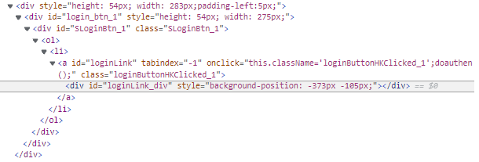
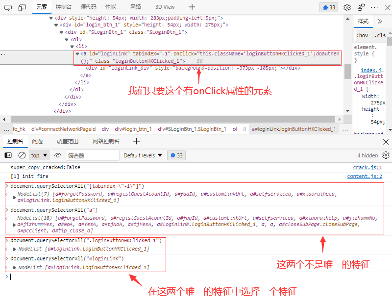
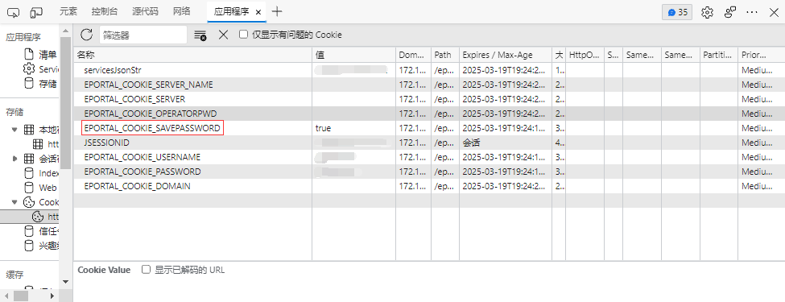

# 校园网自动登录 Xmist

   
**[ [`安装此脚本`](https://tmy.aigio1064.top/Xmist%20Campus%20Network%20Auto%20Login/release.user.js) | [`在GitHub上查看`](https://github.com/Aigio1064/Tmy.aigio1064.top/blob/main/Xmist%20Campus%20Network%20Auto%20Login/release.user.js) ]**  

## 说明

专为 `厦门软件职业技术学院` 设计的校园网自动登录脚本。  
用以替代失效的自动登录功能。  
设计为只需要正常登录一次即可在以后自动完成操作。

## 安全性

所有数据均存储在浏览器，不收集任何信息。
`Tips: 如果连你自己的电脑都信不过，那世界上应该就没有安全的电脑了。`

## 尝试适配兼容其它学校的校园网系统?

脚本内建议修改的地方为了方便都放在脚本最前的位置，所以你应该一眼就能看到。  

### 登录时间设置

你可以看到一个名为`timeSettings`的对象，包含有`Enable`、`loginUP`和`loginOut`三个值，它们分别是 启用时间段设置、开放登录时间和断开网络时间。  

```javascript
const timeSettings = {
    Enable: true,
    loginUP: 6,
    loginOut: 23
};
```

将`Enable`改为`true`就会在 开放登录时间 到 断开网络时间 的时间内进行自动登录，改为`false`则可以在任何时间自动登录，当然! 其实并没有什么用! `Tips:因为都不限制在线时间了还要自动登录干什么(小声`  

### 修改匹配页面 & 页面检测

在 \==UserScript== 注释块中，有几个`@match`段  
  
分别改成你的只到pathname并加上通配符的注册页和登录成功后最终转跳的页面的链接，但是!我有个简单的办法帮你完成，首先按下`CTRL+Shift+I`打开开发者工具，在控制台(console)选项卡内输入

```javascript
location.origin+location.pathname+"*"
```

并按下回车来获取准确的链接，如果你不修改或者改错了，那么这个脚本应该无法正常的运行在你的校园网页面上，并且这与我无关。  
然后你需要在控制台输入

```javascript
location.pathname
```

来取得你的页面路径，并修改`pagePathname`对象里的`login`(登录页)和`success`(最终转跳的页面) `Tips:因为这是必须的!`

```javascript
const pagePathname = {
    Login: "/eportal/index.jsp",
    success: "/eportal/success.jsp"
};
```

### 寻找登录按钮的唯一特征 & 修改`Element`对象

嗯...你可能会疑惑为什么要找它，因为我不知道它会以什么样的代码出现在我面前，所以只能出此下策，同时，我不知道为什么会有那么多天杀的校园网系统!!!  
首先呢! 还是我们熟悉的东东`CTRL+Shift+I`，对，还是开发者工具，然后呢，有一个小小的按钮你可以叫它元素选择工具，因为它就是干这个的，然后点击它或者按`CTRL+Shift+C`用它找到那个美妙的按钮 `Tips:也有可能是丑陋的` 并且按下去  
  
然后不出意外的话，它应该能帮你找到这个按钮元素所在的位置  
  
但是呢，你能看到，它定位到的元素呢，并没有onClick属性，而它的父级`<a>`元素才有一个onClick属性  
  
至于这个 `document.querySelectorAll()`呢，这里有它的用法 [菜鸟教程](https://www.runoob.com/jsref/met-document-queryselectorall.html)  
可以看到，我试了4种方法，至于为什么我不查找那个onClick，因为它太长了! `Tips:我不明白为什么就一个 doauthen() 就能解决的事情为什么硬要搞那么长`  
然后为了尽可能减少代码量，所以我选择了最短的那个，虽然我也搞了挺长一个😜  

```javascript
const Element = {
    loginButton:"#loginLink"
};
```

按照你找到的改哦，改之前记得先试试那个onClick里的东西去掉外圈的引号能不能用喔! 别没试就改喔!  

### 是否保存密码的CookieName

嗯...这个东西也是不确定的，不过呢,应该有一个比较好分辨的办法。  
  
因为是否保存密码这个cookie并不是很需要进行保护的，所以名字里大概率会有个`SavaPasswd`或者`SavePassword`,所以还是比较简单的，只要把名字改一下就好了  

```javascript
const savePasswdCookieName = "EPORTAL_COOKIE_SAVEPASSWORD";
```
